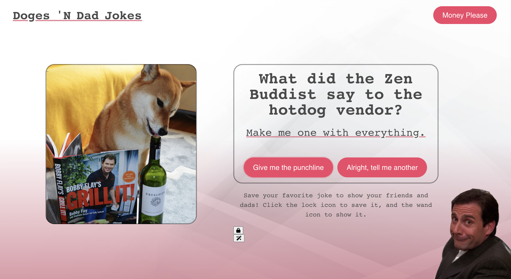
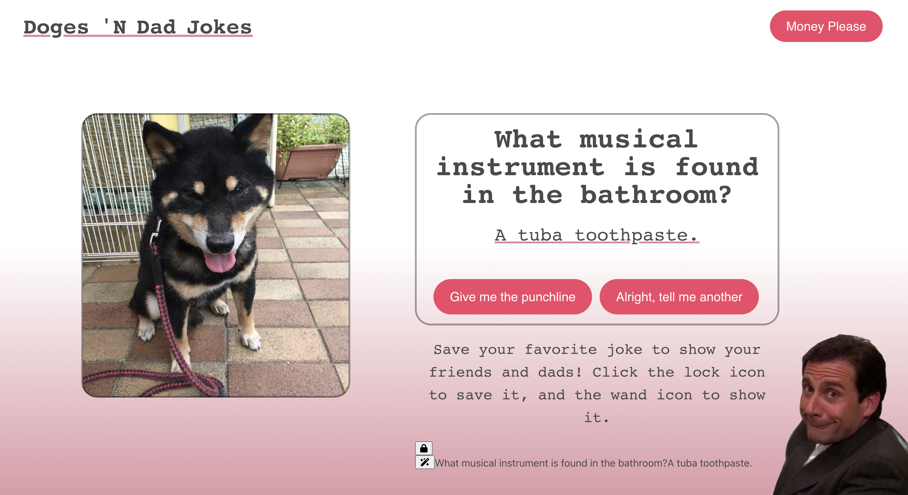

# Doges 'N Dad Jokes

## Description

We created a website using two public API's. Our goal was to create a simple web application that brings levity to the user that is universal. The application allows the user to click on buttons that generate a random silly joke and a corresponding punchline, while automatically displaying a randomly generated picture of a cute Shiba Inu dog in-tandem. It features dynamically updated HTML, JavaScript, CSS and Bulma to allow the page to have a cohesive and user friendly layout that doesn't appear too busy. We have also added a button feature in the navigation bar that directs the user to another page with a couple funny surprises.

### Screenshot

### Links

Deployed Site URL: [https://jacquelinehockin.github.io/Group-1-Project-/]

### Contributors

Jacqueline - https://github.com/JacquelineHockin
Haley - https://github.com/haleymay21
Chase - https://github.com/chasebinkley
Randy - https://github.com/RandyDeCent
